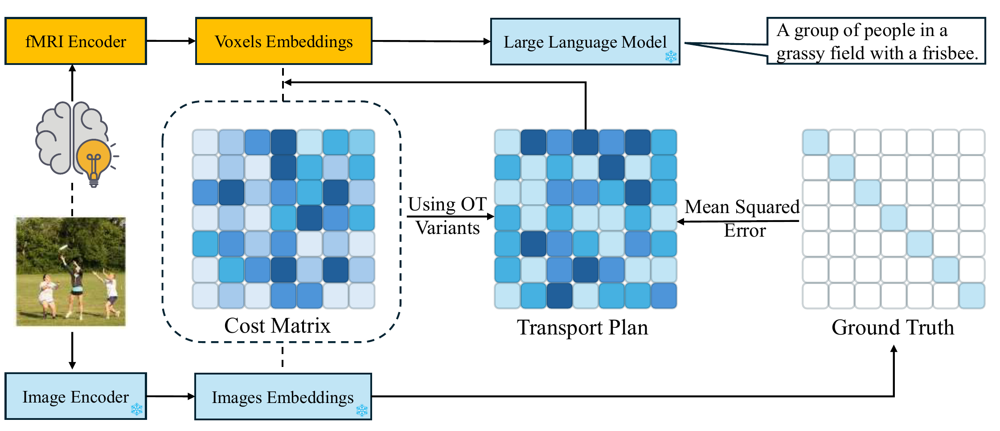
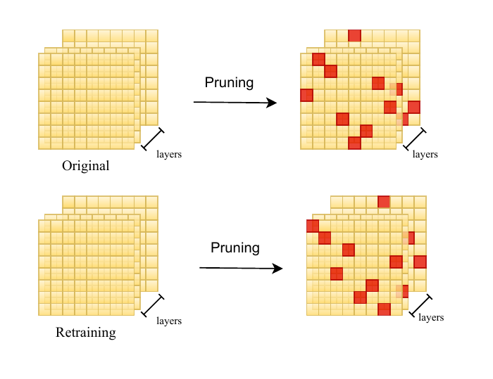
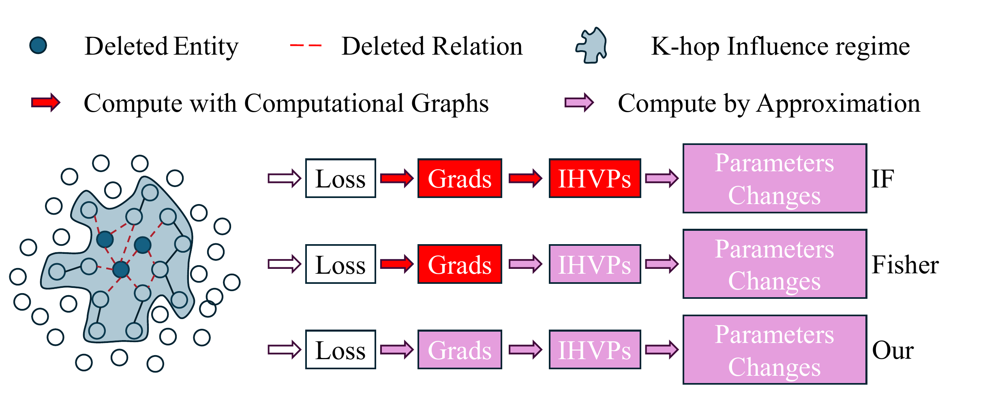
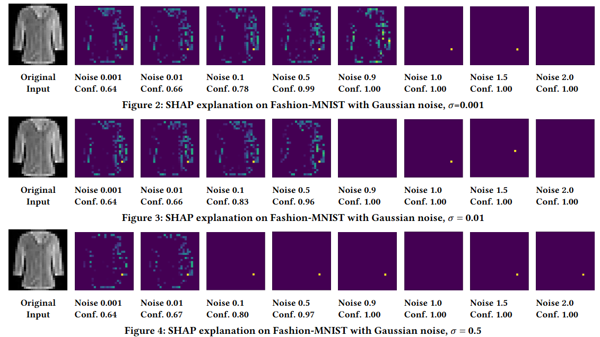

My name is Yang Xiao (肖扬). a Ph.D. student in Computer Science at the University of Tulsa, Tulsa, Oklahoma, USA. I come from China and graduated from Nankai University, Tianjin, China. Now, my research interests are trustworthy artificial intelligence and AI for Science.

<h2 id="new">News</h2>

  <ul id="news-list">
    <li>[2025.09.23] Our paper were accepted by NIPS 2025 RegML Workshop and NIPS 2025 FoRLM Workshop.</li>
    <li>[2025.08.05] Our paper was accepted by CIKM 2025.</li>
    <li>[2025.07.10] Our paper was accepted by ECAI 2025.</li>
    <li>[2025.06.25] Our papers were accepted by ICCV 2025.</li>
    <li class="hidden-news" style="display: none;">[2025.06.16] I am interning at Mayo Clinic, Rochester, MN until August. 23, 2025.</li>
    <li class="hidden-news" style="display: none;">[2025.06.09] Our paper was accepted by ICML 2025 CFAgentic Workshop <strong>Oral</strong>.</li>
    <li class="hidden-news" style="display: none;">[2025.03.06] Our paper was accepted by ICLR 2025 Bi-Align Workshop.</li>
    <li class="hidden-news" style="display: none;">[2024.11.29] Our paper was accepted by COLING 2025.</li>
    <li class="hidden-news" style="display: none;">[2024.11.16] Our paper was accepted by LoG 2024.</li>
    <li class="hidden-news" style="display: none;">[2024.07.15] Our paper was accepted by CIKM 2024.</li>
    <li class="hidden-news" style="display: none;">[2024.06.07] Our paper was accepted by ICIP 2024.</li>
  </ul>
  <button onclick="toggleNews()" id="toggle-button">Show more</button>

 

<h2 id="project">Selected Projects</h2>

  

    
  

  

    <h3 style="margin-top: 0;">LightCache: Memory-Efficient, Training-Free Acceleration for Video Generation</h3>
    

      <b>Generative Models</b>; Video Generation; Diffusion Models; Training-Free Acceleration. 
      The code is available at <a href="https://github.com/NKUShaw/LightCache" target="_blank">here</a>。
    

  

  

    
  

  

    <h3 style="margin-top: 0;"><a href="https://arxiv.org/abs/2503.10663" target="_blank">[ICCV 2025]</a> Optimal Transport for Brain-Image Alignment: Unveiling Redundancy and Synergy in Neural Information Processing</h3>
    

      <b>Multimodal Learning</b>; Vision-Language-Brain Model; Large Language Model;Optimal Transport; Neuroscience. 
      The code is available at <a href="https://github.com/NKUShaw/OT-Alignment4brain-to-image" target="_blank">here</a>。
    

  

  

    
  

  

    <h3 style="margin-top: 0;"><a href="https://arxiv.org/abs/2507.18725" target="_blank">[NeuraIPS 2025 workshop]</a> The Right to be Forgotten in Pruning: Unveil Machine Unlearning on Sparse Models.</h3>
    

      <b>Trustworthy Artificial Intelligence</b>;; Machine Unlearning; Sparse models. 
      The code is available at <a href="https://github.com/NKUShaw/SparseModels" target="_blank">here</a>。
    

  

  

    
  

  

    <h3 style="margin-top: 0;"><a href="https://arxiv.org/abs/2508.14013" target="_blank">[CIKM 2025]</a> Efficient Knowledge Graph Unlearning with Zeroth-order Information</h3>
    

      <b>Trustworthy Artificial Intelligence</b>; Machine Unlearning; Knowledge Graphs; Zeroth-order Optimization. 
      The code is available at <a href="https://github.com/NKUShaw/ZOWFKGIF" target="_blank">here</a>。
    

  

  

    
  

  

    <h3 style="margin-top: 0;"><a href="https://dl.acm.org/doi/abs/10.1145/3627673.3679650" target="_blank">[CIKM 2024]</a> Advancing Certified Robustness of Explanation via Gradient Quantization</h3>
    

      <b>Trustworthy Artificial Intelligence</b>; Explanable Algorithms; Gradient Quantization; Certified Radius. 
      The code is available at <a href="https://github.com/NKUShaw/CertifiedExplanation" target="_blank">here</a>。
    

  

<h2 id="publication">Publication</h2>

## Regular Conference Papers
* [ICCV 2025](https://arxiv.org/abs/2503.10663) Optimal Transport for Brain-Image Alignment: Unveiling Redundancy and Synergy in Neural Information Processing
  *  <b>Yang Xiao</b>, Wang Lu, Jie Ji, Ruimeng Ye, Gen Li, Xiaolong Ma, Bo Hui
* [CIKM 2025](https://arxiv.org/abs/2508.14013) Efficient Knowledge Graph Unlearning with Zeroth-order Information
  *  <b>Yang Xiao</b>, Ruimeng Ye, Bohan Liu, Xiaolong Ma, Bo Hui
* [CIKM 2024](https://dl.acm.org/doi/abs/10.1145/3627673.3679650) Advancing Certified Robustness of Explanation via Gradient Quantization
  * <b>Yang Xiao</b>, Zijie Zhang, Yuchen Fang, Da Yan, Yang Zhou, Wei-Shinn Ku, Bo Hui
* [ICCV 2025](https://arxiv.org/abs/2504.09039) Sculpting Memory: Multi-Concept Forgetting in Diffusion Models via Dynamic Mask and Concept-Aware Optimization
  *  Gen Li, <b>Yang Xiao</b>, Jie Ji, Kaiyuan Deng, Bo Hui, Linke Guo, Xiaolong Ma
* [ECAI 2025](https://arxiv.org/abs/2501.15005) DBA-DFL: Towards Distributed Backdoor Attacks with Network Detection in Decentralized Federated Learning. 
  * Bohan Liu, <b>Yang Xiao</b>, Ruimeng Ye, Zinan Ling, Xiaolong Ma, Bo Hui.
* [ICIP 2024](https://ieeexplore.ieee.org/abstract/document/10647534) BMT-BENCH: A Benchmark Sports Dataset for Video Generation
  * Ziang Shi, <b>Yang Xiao</b>, Da Yan, Min-Te-Sun, Wei-Shinn Ku, Bo Hui
 
## Short Conference Papers
* [COLING 2025](https://aclanthology.org/2025.coling-main.238/) Knowledge Graph Unlearning with Schema 
  * <b>Yang Xiao</b>, Ruimeng Ye, Bo Hui
* [LoG 2024](https://openreview.net/pdf?id=y8RGPFy6MX) Knowledge Graph Unlearning with Schema (Extented Abstract)
  * <b>Yang Xiao</b>, Ruimeng Ye, Bo Hui

## Workshop Papers
* [ICML 2025 Workshop](https://arxiv.org/abs/2501.15005) DBA-DFL: Towards Distributed Backdoor Attacks with Network Detection in Decentralized Federated Learning. <b>Oral</b>
  * Bohan Liu, <b>Yang Xiao</b>, Ruimeng Ye, Zinan Ling, Xiaolong Ma, Bo Hui.
* [ICLR 2025 Workshop](https://arxiv.org/abs/2410.12621) Weak-to-Strong Generalization beyond Accuracy: a Pilot Study in Safety, Toxicity, and Legal Reasoning. 
  * Ruimeng Ye, <b>Yang Xiao</b>, Bo Hui.
* [NIPS 2025 Workshop](https://arxiv.org/abs/2507.18725) The Right to be Forgotten in Pruning: Unveil Machine Unlearning on Sparse Models.
  * <b>Yang Xiao</b>, Gen Li, Jie Ji, Ruimeng Ye, Xiaolong Ma, Bo Hui.
* [NIPS 2025 Workshop](https://arxiv.org/abs/2507.18858) Weak-to-Strong Generalization with Failure Trajectories: A Tree-based Approach to Elicit Optimal Policy in Strong Models.
  * Ruimeng Ye, Zihan Wang, <b>Yang Xiao</b>, Zinan Ling, Manling Li, Bo Hui

 
## Pre-print Papers
* [arXiv](https://arxiv.org/abs/2403.04861) A Survey of Lottery Ticket Hypothesis.
  * Bohan Liu, Zijie Zhang, Peixiong He, Zhensen Wang, <b>Yang Xiao</b>, Ruimeng Ye, Yang Zhou, Wei-Shinn Ku, Bo Hui.

## Submitted Papers
* [ICLR 2026] A paper about Diffusion.
* [ICLR 2026] A paper about Machine Unlearning.

## CCF Paper Statistics 
<table id="ccf-table" style="width:80%; text-align:center; border-collapse: collapse;" border="1">
  <thead>
    <tr style="background-color:#f2f2f2;">
      <th>Category</th>
      <th>2024</th>
      <th>2025</th>
      <th>2026</th>
      <th>2027</th>
      <th>2028</th>
      <th>Total</th>
    </tr>
  </thead>
  <tbody>
    <tr>
      <td><strong>CCF-A</strong></td>
      <td>0</td>
      <td>2</td>
      <td>Unknown</td>
      <td>Unknown</td>
      <td>Unknown</td>
      <td>2</td>
    </tr>
    <tr>
      <td><strong>CCF-B</strong></td>
      <td>1</td>
      <td>2</td>
      <td>Unknown</td>
      <td>Unknown</td>
      <td>Unknown</td>
      <td>3</td>
    </tr>
    <tr>
      <td><strong>CCF-C</strong></td>
      <td>1</td>
      <td>0</td>
      <td>Unknown</td>
      <td>Unknown</td>
      <td>Unknown</td>
      <td>1</td>
    </tr>
    <tr>
      <td><strong>Citation</strong></td>
      <td>7</td>
      <td>18</td>
      <td>Unknown</td>
      <td>Unknown</td>
      <td>Unknown</td>
      <td>25</td>
    </tr>
  </tbody>
</table>
 

## 屡败屡战
[2025.09] NIPS reject 

[2025.05] ACL reject &rarr; CIKM 2025

[2025.05] ICML reject &rarr; NIPS 2025

[2024.12] AAAI reject &rarr; ACL 2025

[2024.07] ACL desk reject for stupid reason (don't ask me) &rarr; COLING 2025 and LoG 2024

[2024.05] UAI withdrawn &rarr; CIKM 2024

